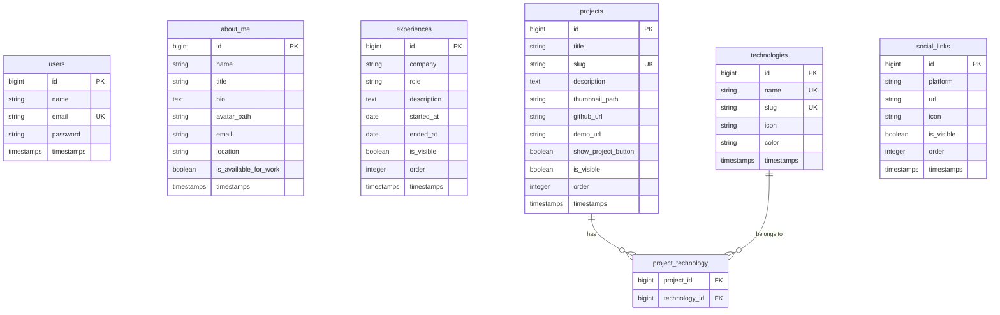

<p align="center">
  
</p>

# Portfólio — Kaiki Hirata

> Sistema de portfólio profissional full-stack com painel administrativo, construído com **Laravel 13**, arquitetura em camadas e cobertura de testes automatizados.

[](https://www.php.net/)
[](https://laravel.com/)
[](LICENSE)

---

## Índice

- [Visão Geral](#visão-geral)
- [Arquitetura](#arquitetura)
- [Stack Tecnológico](#stack-tecnológico)
- [Pré-requisitos](#pré-requisitos)
- [Instalação](#instalação)
- [Configuração](#configuração)
- [Uso](#uso)
- [Estrutura do Projeto](#estrutura-do-projeto)
- [Banco de Dados](#banco-de-dados)
- [Testes](#testes)
- [Segurança](#segurança)
- [Deploy](#deploy)
- [Licença](#licença)

---

## Visão Geral

Aplicação web que combina um **portfólio público** com visual moderno (dark mode, glassmorphism, parallax) e um **painel administrativo responsivo** para gerenciamento completo do conteúdo — sem necessidade de alteração de código-fonte.

### Funcionalidades

**Portfólio Público**
- Hero section com avatar, nome, título e badges de disponibilidade
- Seção de tecnologias com ícones Devicon dinâmicos
- Timeline de experiências profissionais
- Grid de projetos com thumbnails, tags de tecnologias e links
- Redes sociais com ícones automáticos
- Tema claro/escuro com persistência em `localStorage`
- Scroll suave, parallax nos orbs de fundo, animações de reveal
- Totalmente responsivo (mobile-first)

**Painel Administrativo**
- Dashboard com métricas e ações rápidas
- CRUD completo para: Experiências, Projetos, Tecnologias e Redes Sociais
- Edição do perfil "Sobre Mim" (bio, avatar, disponibilidade)
- Toggle de visibilidade e botão "Ver Projeto" por projeto
- Upload de avatares e thumbnails com preview
- Sidebar responsiva com menu hamburger no mobile
- Flash messages estilizadas para feedback de operações

**Segurança**
- Autenticação via Laravel Fortify com Argon2id
- Rate limiting de login por IP + email
- Gate `isAdmin` + Policies para autorização
- Redirecionamento silencioso de rotas 404/403 para home
- Proteção contra SQL Injection, XSS e IDOR (testado)

---

## Arquitetura

A aplicação segue princípios **SOLID** com separação rigorosa de responsabilidades em camadas:

```
HTTP Request
    ↓
Middleware (auth, AdminOnly, CSRF, throttle)
    ↓
Form Request  →  Valida entrada + verifica autorização via Policy/Gate
    ↓
Controller    →  Recebe dados validados, delega para Action
    ↓
Action        →  Executa regra de negócio (transação, upload, etc.)
    ↓
Repository    →  Abstrai o acesso ao banco via interface
    ↓
Model         →  Persistência, relacionamentos e scopes
    ↓
Response / View (Blade)
```

### Decisões Arquiteturais

| Decisão | Justificativa |
|---------|---------------|
| **Repository Pattern** | Desacopla queries do controller/action, facilita troca de implementação |
| **Actions** (single-purpose) | Cada operação CRUD tem sua classe — testável, coesa e reutilizável |
| **FileStorageService** | Suporte transversal de upload/deleção, injetado via construtor nas Actions |
| **Fortify sem Sanctum** | App puramente web com Blade, sem API REST — Sanctum seria redundante |
| **CDN (Tailwind, FA, Devicon)** | Sem pipeline de build necessário — agilidade no desenvolvimento |
| **Gate único `isAdmin`** | Sistema single-admin — identificação por email via `config/admin.php` |

---

## Stack Tecnológico

### Backend

| Tecnologia | Versão | Finalidade |
|------------|--------|------------|
| PHP | 8.3+ | Linguagem base |
| Laravel | 13.x | Framework principal |
| Laravel Fortify | 1.36+ | Autenticação (login, logout, rate limiting) |
| Pest + PHPUnit | 4.6+ / 12.5+ | Testes automatizados |
| MySQL / SQLite | — | Banco de dados (SQLite in-memory para testes) |

### Frontend

| Tecnologia | Finalidade |
|------------|------------|
| Blade Templates | Motor de templates do Laravel |
| Tailwind CSS (CDN) | Estilização utilitária |
| Font Awesome 6 (CDN) | Ícones de UI |
| Devicon (CDN) | Ícones de tecnologias e redes sociais |
| Vanilla JS | Interatividade (tema, scroll, parallax, clipboard) |

---

## Pré-requisitos

- **PHP** ≥ 8.3 com extensões: `pdo_mysql`, `mbstring`, `openssl`, `gd`
- **Composer** ≥ 2.x
- **MySQL** ≥ 8.0 (ou MariaDB ≥ 10.6)
- **Node.js** ≥ 18 e **npm** (para assets, opcional)
- **Git**

---

## Instalação

```bash
# 1. Clonar o repositório
git clone https://github.com/kaikiyuuji/kyhirata-laravel-portfolio.git
cd kyhirata-laravel-portfolio

# 2. Instalar dependências PHP
composer install

# 3. Copiar e configurar variáveis de ambiente
cp .env.example .env
php artisan key:generate

# 4. Configurar banco de dados no .env (ver seção Configuração)

# 5. Executar migrations e seeders
php artisan migrate --seed

# 6. Criar symlink do storage
php artisan storage:link

# 7. Iniciar o servidor de desenvolvimento
php artisan serve
```

O portfólio estará disponível em `http://localhost:8000` e o painel em `http://localhost:8000/admin`.

---

## Configuração

### Variáveis de Ambiente (`.env`)

```env
# ─── App ────────────────────────────────────
APP_NAME="Portfolio"
APP_ENV=local
APP_DEBUG=true
APP_URL=http://localhost

# ─── Banco de Dados ────────────────────────
DB_CONNECTION=mysql
DB_HOST=127.0.0.1
DB_PORT=3306
DB_DATABASE=portfolio
DB_USERNAME=root
DB_PASSWORD=

# ─── Hashing (Argon2id) ───────────────────
HASH_DRIVER=argon2id
ARGON_MEMORY=65536
ARGON_THREADS=1
ARGON_TIME=4

# ─── Sessão ────────────────────────────────
SESSION_DRIVER=database
SESSION_LIFETIME=120
SESSION_SECURE_COOKIE=false       # true em produção (HTTPS)
SESSION_HTTP_ONLY=true
SESSION_SAME_SITE=lax

# ─── Admin ─────────────────────────────────
ADMIN_EMAIL=admin@portfolio.test  # E-mail do administrador

# ─── Queue ─────────────────────────────────
QUEUE_CONNECTION=database
```

### Credenciais Padrão (Seeder)

| Campo | Valor |
|-------|-------|
| E-mail | `admin@portfolio.test` |
| Senha | `password` |

---

## Uso

### Portfólio Público

Acessível em `/` — exibe automaticamente todo o conteúdo marcado como **visível** no painel administrativo.

### Painel Administrativo

Acessível em `/admin` após login em `/login`.

| Seção | Rota | Operações |
|-------|------|-----------|
| Dashboard | `/admin/dashboard` | Visão geral com métricas |
| Sobre Mim | `/admin/about/edit` | Edição do perfil (nome, bio, avatar) |
| Experiências | `/admin/experiences` | CRUD completo |
| Projetos | `/admin/projects` | CRUD + toggle de botão + tecnologias |
| Tecnologias | `/admin/technologies` | CRUD com ícone Devicon e cor |
| Redes Sociais | `/admin/social-links` | CRUD com ícone Devicon |

---

## Estrutura do Projeto

```
app/
├── Actions/Admin/           # Operações de negócio (Create, Update, Delete, Toggle)
│   ├── AboutMe/
│   ├── Experience/
│   ├── Project/
│   ├── SocialLink/
│   └── Technology/
├── Http/
│   ├── Controllers/
│   │   ├── Admin/           # Controllers administrativos (resource)
│   │   └── Public/          # PortfolioController
│   ├── Middleware/           # AdminOnly
│   └── Requests/Admin/      # Form Requests por entidade (Store + Update)
├── Models/                  # User, AboutMe, Experience, Project, Technology, SocialLink
├── Policies/                # Autorização por entidade
├── Repositories/
│   ├── Contracts/           # Interfaces de repositório
│   └── Eloquent/            # Implementações Eloquent
├── Services/                # FileStorageService (upload/deleção transversal)
└── Providers/               # AppServiceProvider, FortifyServiceProvider

resources/views/
├── auth/login.blade.php     # Tela de login com glassmorphism
├── layouts/
│   ├── admin.blade.php      # Layout admin com sidebar responsiva
│   └── app.blade.php        # Layout público
├── admin/                   # Views CRUD (index, create, edit, _form)
│   ├── about/
│   ├── dashboard.blade.php
│   ├── experiences/
│   ├── projects/
│   ├── social-links/
│   └── technologies/
└── portfolio/
    └── index.blade.php      # Página pública do portfólio

tests/
├── Feature/
│   ├── Admin/               # Testes CRUD para cada entidade
│   ├── Auth/                # Login e Logout
│   ├── Public/              # Renderização do portfólio público
│   └── Security/            # SQL Injection, XSS, IDOR, Rate Limiting
└── Unit/
    ├── Actions/             # Testes unitários das Actions (com mocks)
    └── Repositories/        # Testes de integração dos Repositories
```

---

## Banco de Dados

### Diagrama de Entidades



---

## Testes

A suíte de testes cobre autenticação, autorização, validação, CRUD, segurança e renderização pública.

```bash
# Executar todos os testes
php artisan test

# Com cobertura
php artisan test --coverage

# Apenas testes de segurança
php artisan test --filter=Security

# Apenas testes de um recurso
php artisan test --filter=ProjectTest
```

### Organização dos Testes

| Grupo | Diretório | Escopo |
|-------|-----------|--------|
| Autenticação | `Feature/Auth/` | Login, logout, rate limiting |
| Autorização | `Feature/Security/` | Guest, non-admin, admin access |
| CRUD Admin | `Feature/Admin/` | Store, update, destroy por entidade |
| Segurança | `Feature/Security/` | SQLi, XSS, IDOR, Rate Limit |
| Portfólio Público | `Feature/Public/` | Visibilidade, renderização, botões |
| Actions | `Unit/Actions/` | Lógica de negócio com mocks |
| Repositories | `Unit/Repositories/` | Queries com SQLite in-memory |

---

## Segurança

### Checklist Implementado

| Categoria | Medida | Status |
|-----------|--------|--------|
| **Autenticação** | Argon2id como driver de hash | ✅ |
| | Mensagem genérica em falha de login | ✅ |
| | Rate limiting por IP + email | ✅ |
| | Cookie de sessão `HttpOnly` + `SameSite=lax` | ✅ |
| **Autorização** | Gate `isAdmin` + Policies em todas as rotas | ✅ |
| | Middleware `AdminOnly` em `/admin/*` | ✅ |
| | Redirecionamento 404/403 → home (anti-enumeration) | ✅ |
| **Entrada** | `@csrf` em todos os formulários | ✅ |
| | `$request->validated()` exclusivamente | ✅ |
| | `$fillable` explícito em todos os Models | ✅ |
| | Upload validado por MIME + tamanho máximo | ✅ |
| **Saída** | Blade `{{ }}` escapa HTML por padrão | ✅ |
| | `APP_DEBUG=false` em produção | ⏳ |
| **Banco** | Queries via Eloquent (bindings parametrizados) | ✅ |
| | `DB::transaction()` em operações multi-tabela | ✅ |

---

## Deploy

### Checklist de Produção

```bash
# 1. Configurar .env para produção
APP_ENV=production
APP_DEBUG=false
APP_URL=https://seu-dominio.com
SESSION_SECURE_COOKIE=true

# 2. Otimizar
php artisan config:cache
php artisan route:cache
php artisan view:cache
php artisan optimize

# 3. Garantir symlink do storage
php artisan storage:link

# 4. Executar migrations
php artisan migrate --force

# 5. Iniciar queue worker (se utilizando jobs)
php artisan queue:work --daemon
```

---

## Licença

Este projeto está licenciado sob a [MIT License](LICENSE).

**© 2026 Kaiki Hirata**
